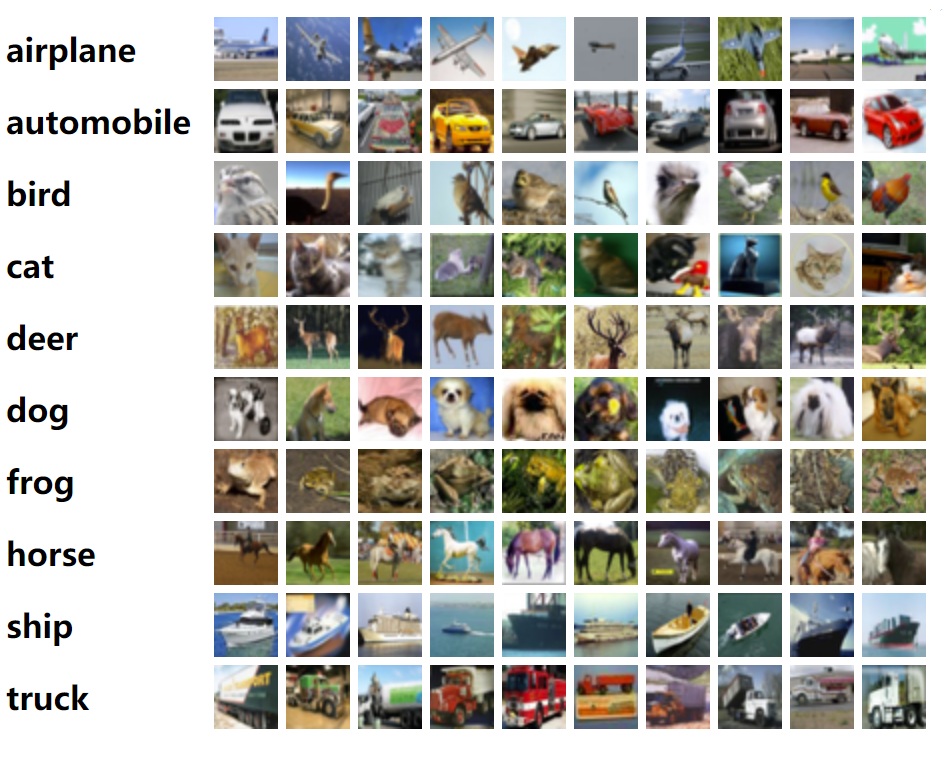
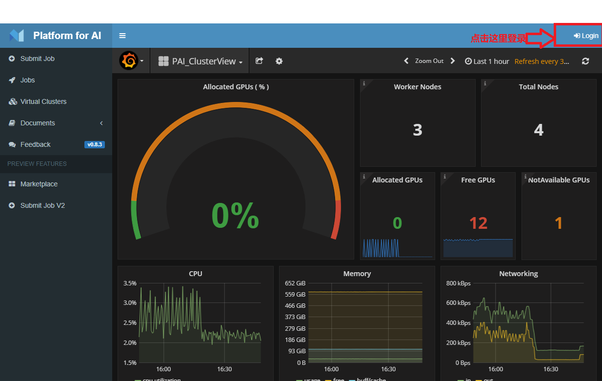
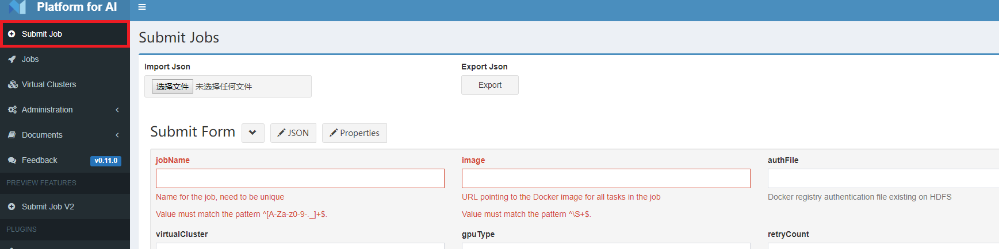
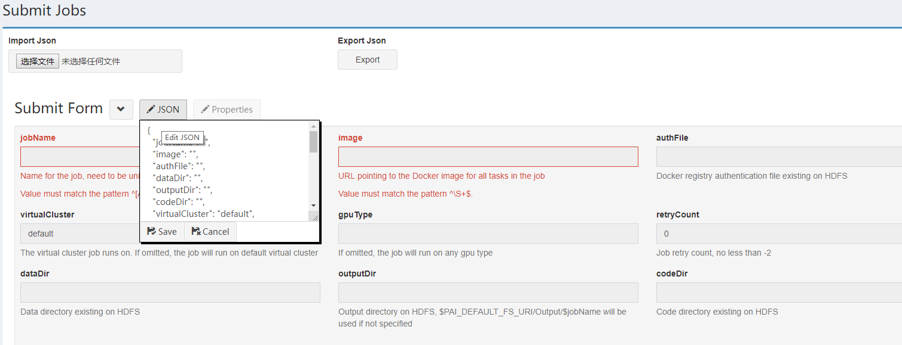
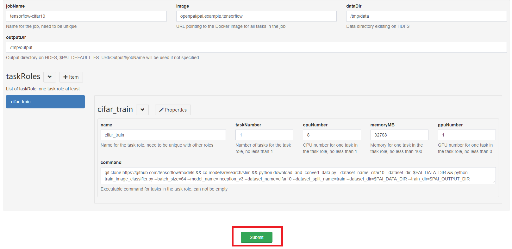
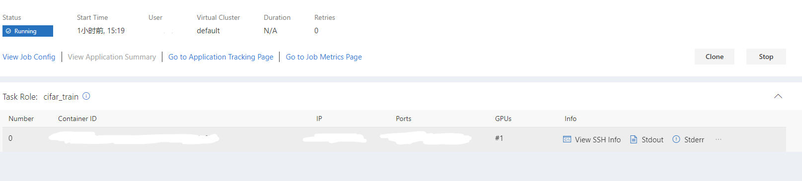

# 利用OpenPAI训练CIFAR-10和MNIST

## 知识要点

- OpenPAI的初步了解
- CIFAR-10和MNIST数据集的初步了解
- 使用OpenPAI提交训练任务

## 建立知识库

### 什么是OpenPAI?

[OpenPAI](https://github.com/Microsoft/pai)是一个开源的，提供了完整的AI模型训练和资源管理能力的平台，可以部署在各种规模的机器或集群上，可以有效的发挥硬件能力和处理训练任务。
此外，OpenPAI还支持现有的流行的AI训练框架，支持分布式训练等等。
OpenPAI可以为个人用户提高GPU利用率，也可以为多用户灵活分配调度GPU资源，详细介绍请参看[视频](https://www.bilibili.com/video/av26482357/)

### CIFAR-10和MNIST简介

[CIFAR-10](https://www.cs.toronto.edu/~kriz/cifar.html)是由10类，60000张32*32大小的彩色图片构成的数据集，该数据集由Alex Krizhevsky和Ilya Sutskever收集而成，分为50000张图片的训练集和10000张图片的测试集。部分CIFAR-10示例图片如下图所示：


[MNIST](http://yann.lecun.com/exdb/mnist/)数据集来自美国国家标准与技术研究所，该数据集由手写字符‘0’到‘9’共10类手写字符图片组成，每张图片是32*32大小的灰度图片。该数据集中包含60000张训练图片和10000张测试图片。MNIST中的图片一般是这个样子的:


## 利用OpenPAI提交训练任务

1. 登录OpenPAI平台

    在浏览器中输入OpenPAI的IP地址或者域名，进入OpenPAI的页面，输出对应的账号和密码，若未弹出登录窗口，则请点击右上角的`Login`进行登录。

    

2. 提交任务界面

    在登录成功后，点击`Submit Job`选项进入提交任务界面

    

3. 提交任务配置信息

    点击JSON按钮，输入对应的任务配置信息，

    

    注意到，这个JSON文件中的有关信息配置中有任务名称，使用的docker地址等等，各项配置的具体意义请参照这份[说明](https://github.com/Microsoft/pai/blob/master/docs/job_tutorial.md)

    在这里，我们分别使用`tensorflow`来运行`CIFAR-10`和`Pytorch`来运行`MNIST`。

    运行`CIFAR-10`对应的示例信息为：

    ```JSON
    {
        "jobName": "tensorflow-cifar10",
        "image": "openpai/pai.example.tensorflow",

        "dataDir": "/tmp/data",
        "outputDir": "/tmp/output",

        "taskRoles": [
            {
                "name": "cifar_train",
                "taskNumber": 1,
                "cpuNumber": 8,
                "memoryMB": 32768,
                "gpuNumber": 1,
                "command": "git clone https://github.com/tensorflow/models && cd models/research/slim && python download_and_convert_data.py --dataset_name=cifar10 --dataset_dir=$PAI_DATA_DIR && python train_image_classifier.py --batch_size=64 --model_name=inception_v3 --dataset_name=cifar10 --dataset_split_name=train --dataset_dir=$PAI_DATA_DIR --train_dir=$PAI_OUTPUT_DIR"
            }
        ]
    }
    ```

    简单分析一下上面的配置文件，我们将这个为这个任务取名为`tensorflow-cifar10`，使用的tensorflow的docker的地址为`openpai/pai.example.tensorflow`，存放数据的地址为`/tmp/data`，存放输出结果的地址为`/tmp/output`。之后我们在`taskRoles`中配置了具体要执行的命令等等。

    这里使用的Docker地址是OpenPAI中默认自带的tensorflow环境的Docker。当然，在某些情况下可能我们需要自己去配置一个Docker，自己配置Docker的教程在[这里](https://github.com/Microsoft/pai/blob/master/docs/job_docker_env.md)。

    另外注意到，在这里我们使用的是tensorflow的代码来完成了对`CIFAR-10`数据的下载，我们可不可以自己传数据到平台去？使用自己的数据请参考`ImageNet`的[例子](https://github.com/Microsoft/pai/blob/master/examples/tensorflow/README.md)。

4. 提交任务

    在输入完配置文件信息后，点击保存，我们可以看到界面中出现了如下信息：

    

    看到任务的名字，任务的各项配置都已经显示在对应的位置，检查无误后点击`Submit`选项提交任务即可。

5. 任务状态监控

    在提交完任务之后，页面会重定向到`Jobs`页面，在这里，我们可以看到提交的任务所处的状态：

    

    点击任务名称我们可以看到任务的详细信息，

    

    我们可以点击这个界面中的各种选项看到目前任务进行的各项状态，输出信息等等。

# 课堂练习--MNIST训练

在这里，我们提供MNIST训练对应的`Pytorch`配置代码，请大家按照上述步骤完成对MNIST数据的训练。

```JSON
{
    "jobName": "pytorch-mnist",
    "image": "openpai/pai.example.pytorch",
    "taskRoles": [
        {
            "name": "main",
            "taskNumber": 1,
            "cpuNumber": 4,
            "memoryMB": 8192,
            "gpuNumber": 1,
            "command": "cd examples/mnist && python main.py"
        }
    ]
}
```
